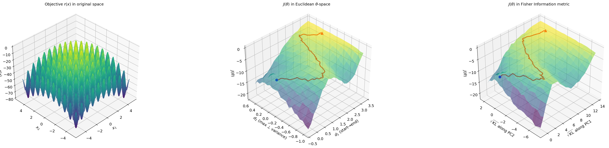

# RL-smoothen-landscape
This is a little project try to understand why RL works. Here, I'm interested in why we go into a millions of parameters space (a quite high dimensional space) to solve a low dimensional problem, and it works better in most hard optimal problem.


# toy model
A folder where the toy model project is put.

  - env.py — Defines the Rastrigin objective function and its negation as the reward $r(x) = -\text{Rastrigin}(x)$.
  Provides both PyTorch and NumPy versions.
  - model.py — Implements the Generator class: a conditional Gaussian MLP that maps latent noise $z \sim \mathcal{N}(0,
  I_8)$ to 2D samples $x$ via a hybrid variance design. Includes sample(), log_prob(), and a pretrain() function that
  fits the model to a uniform distribution over $[-5,5]^2$.
  - ppo.py — PPO training loop. Samples batches from the current policy, computes clipped surrogate loss with KL penalty
   against a frozen base model, and records training history (rewards, KL divergence, parameter snapshots).
  - direct_optim.py — CMA-ES baseline. Directly optimizes $r(x)$ in $x$-space with random restarts, serving as an
  evaluation-matched comparison to the RL approach.
  - fim.py — Fisher Information Matrix landscape analysis. Performs PCA on the PPO parameter trajectory to extract a 2D
  slice, scans $J(\theta)$ and the FIM field on a $41 \times 41$ grid, and constructs the KL coordinate transformation
  for information-geometric visualization.
  - visualize.py — Generates three outputs: (1) a three-panel landscape comparison (raw $r(x)$ / Euclidean $J(\theta)$ /
   FIM-metric $J(\theta)$), (2) an animated GIF comparing CMA-ES and PPO trajectories, (3) convergence curves.
  - run.py — Main entry point. Orchestrates the full pipeline: pretrain → PPO → CMA-ES → FIM landscape scan →
  visualization. Sets all hyperparameters and random seeds.
  - diag_fim.py — Diagnostic script that verifies the FIM is position-dependent (non-constant) across the parameter
  space, validating the hybrid variance design.

# Report.md
A theory report which claims the main ideas of this project. Some important theorems are proved in it.

The most important theorem proved in 4.2 section of the file is that:

For any parametric family $\pi_\theta$ with $\mathrm{Var}_ {\pi_\theta}(r) < \infty$:

```math
\|\tilde{\nabla}_\theta J(\theta)\|_F^2 \leq \mathrm{Var}_{\pi_\theta}(r) \leq \max \text{supp}_{\pi_\theta(x)} r^2(x) \leq R_\max ^2
```

**which implies that a good base model $\pi_\theta(x)$ avoid $|r(x)|\to\infty$ is quite important for the validty of RL.**



# technical_report.md
A report tells the settings and detials of the toy model, and review the knowledge of sampling and PPO in this toy model. (Which helps author learn some ignored but important techniques). 
