# RL Flow 实验可视化指南

本文档介绍 `model.py` 生成的 11 张图的含义和解读方法。

实验流程：Normalizing Flow (RealNVP/Spline) 先在 Boltzmann 分布上预训练，再用 PPO 微调使采样集中到 2D Rastrigin 函数的全局最优点；同时用 CMA-ES 做直接搜索作为对照。

---

## Fig 1: 景观对比 (Landscape Comparison)

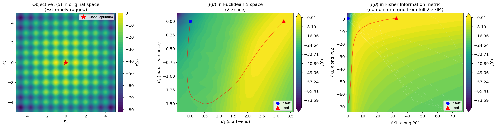

**三面板**（需 `--scan`）：

| 面板 | 坐标系 | 内容 |
|------|--------|------|
| 左 | 原始 $x$-空间 | Rastrigin 奖励函数 $r(x)$，红星为全局最优 |
| 中 | 欧氏 $\theta$-空间 | $J(\theta) = \mathbb{E}_{\pi_\theta}[r(x)]$ 在 PCA 二维切面上的热力图 |
| 右 | Fisher 信息度量空间 | 同一 $J(\theta)$，但坐标被 FIM 非均匀拉伸，白色网格线显示欧氏→KL 的变形 |

**怎么看**：
- 左图展示问题本身的难度——多峰、密集的局部极值
- 中图展示参数空间中的景观——PPO 轨迹（红线）从蓝点(Start)走向红三角(End)
- 右图展示"分布空间"中的景观——如果某方向 FIM 大，该方向被拉伸（微小参数变化引起大的分布变化）

**注意**：右面板的 KL 坐标基于 $F_{12} \approx 0$ 的近似，存在路径依赖问题，仅供定性参考。

---

## Fig 2: 优化轨迹动画 (Trajectory Animation)

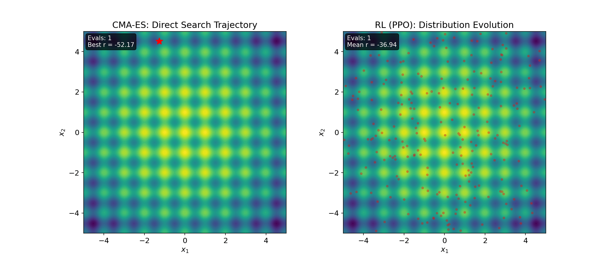

**两面板 GIF**，按 function evaluations 同步推进：

| 左 | 右 |
|----|----|
| CMA-ES 的搜索轨迹（红色散点 = 当前种群，红星 = 历史最优，红线 = 最优解轨迹） | PPO 的分布演化（红色散点 = 当前 $\pi_\theta$ 的采样） |

**怎么看**：
- CMA-ES 是直接在 $x$-空间搜索，从随机散布逐渐收缩到最优点
- PPO 是调整分布参数 $\theta$，使采样从分散变为集中
- 两者按同一时间轴（评估次数）同步，可直接比较收敛速度
- 注意 PPO 每一步同时评估整个 batch（并行），CMA-ES 也是 population-based

---

## Fig 3: 收敛曲线 (Convergence Comparison)

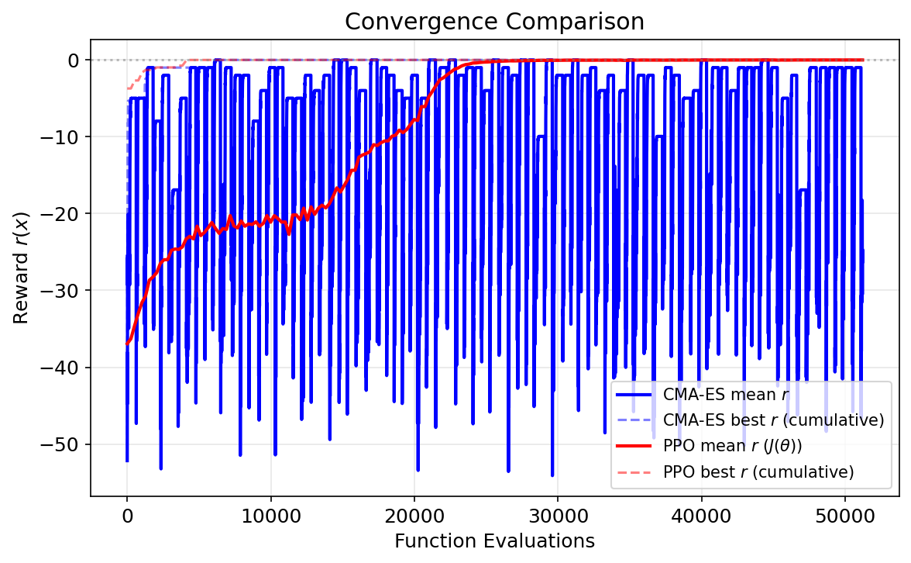

**x 轴**：Function Evaluations（总评估次数）
**y 轴**：Reward $r(x)$

| 曲线 | 含义 |
|------|------|
| 蓝色实线 | CMA-ES 当代种群平均 reward |
| 蓝色虚线 | CMA-ES 累积最佳 reward |
| 红色实线 | PPO 平均 reward $J(\theta)$ |
| 红色虚线 | PPO 累积最佳 reward |

**怎么看**：
- 实线代表**当前策略/种群的质量**——PPO 的实线就是 $J(\theta)$
- 虚线代表**历史最优**——CMA-ES 探索到的最好单个解
- PPO 的优势在于分布质量（实线）也提升，而非只找到个别好解
- Rastrigin 最优值为 0，越接近 0 越好

---

## Fig 4: 3D 景观 (3D Landscape)

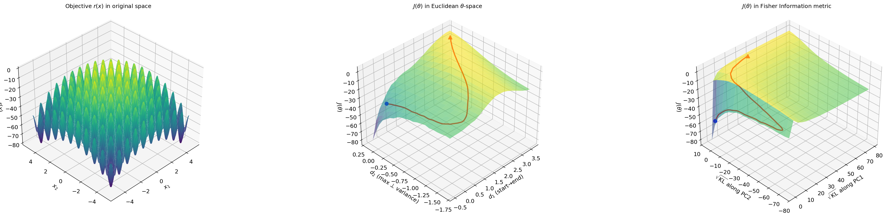

与 Fig 1 相同的数据，以 3D 曲面图呈现（需 `--scan`）。PPO 轨迹绑定在曲面上。

**怎么看**：
- 左图 $r(x)$ 的 3D 地形——直观感受多峰景观的"崎岖程度"
- 中图 $J(\theta)$ 在参数空间——PPO 轨迹（红线）是否在"下坡"行走
- 右图 FIM 坐标下的 $J(\theta)$——景观是否变得更平滑（FIM 拉伸后）
- 旋转视角 (elev=35, azim=225) 已固定，如需调整可修改代码

---

## Fig 5: 预训练数据集 (Pretraining Dataset)

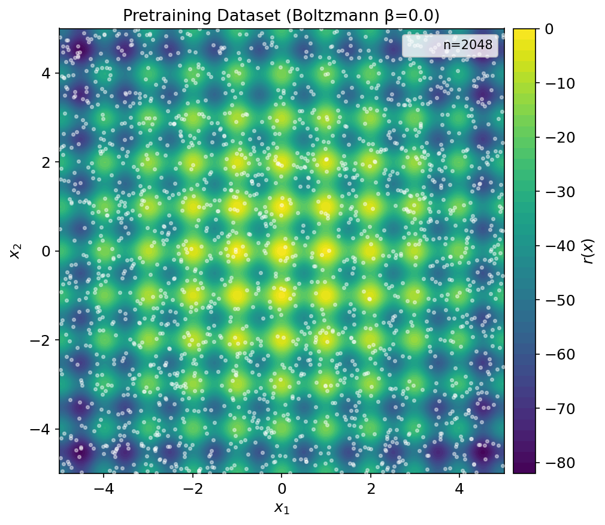

白色散点叠加在 $r(x)$ 热力图上，展示 Boltzmann 预训练用的数据分布。

**怎么看**：
- `beta=0.0`：均匀分布在 $[-5, 5]^2$，模型学习覆盖整个定义域
- `beta>0`：数据集偏向高 reward 区域，预训练后模型起点更好
- `dataset_size=0`：每个 epoch 重新采样；`>0`：固定数据集（防止过拟合比较）

---

## Fig 6: 概率分布对比 (Distribution Comparison)

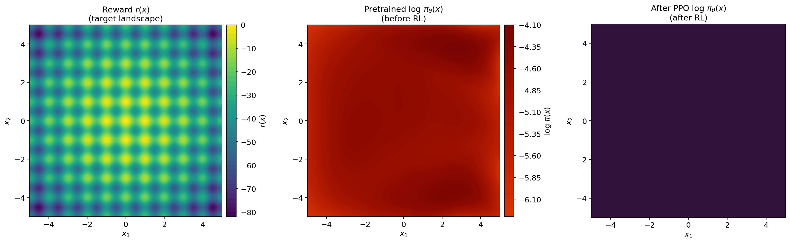

**三面板**：

| 面板 | 内容 |
|------|------|
| 左 | 奖励函数 $r(x)$（参考） |
| 中 | 预训练后的 $\log \pi_\theta(x)$ |
| 右 | PPO 微调后的 $\log \pi_\theta(x)$ |

**怎么看**：
- 中图应接近均匀分布（`beta=0` 时）或 Boltzmann 分布
- 右图应在全局最优点 $(0, 0)$ 附近有明显的概率峰
- 颜色越亮（红/黄）= 概率密度越高
- 如果右图出现多个峰 → 模型被困在局部极值

---

## Fig 7: 分布演化动画 (Distribution Evolution)

**GIF 动画**：逐帧展示每个 PPO iteration 的 $\log \pi_\theta(x)$ 热力图。

**怎么看**：
- 观察概率质量如何从均匀分散逐渐聚集到最优点
- 关注是否经历"中间多峰"阶段——先聚到几个局部最优，最终收敛到全局
- 演化速度不均匀——配合 Fig 8 的 FIM 曲线，FIM 大的阶段对应分布剧烈变化的时期
- 如果演化卡住不动 → 可能是 KL penalty 过大或学习率不足

---

## Fig 8: FIM 沿轨迹的演化 (FIM Evolution)

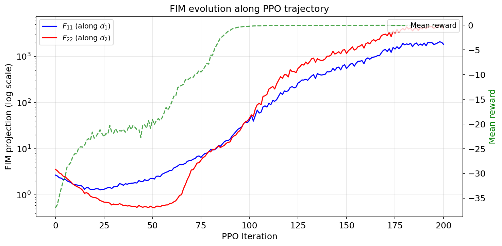

**核心图之一**。左 y 轴 (log scale)：$F_{11}(t)$, $F_{22}(t)$；右 y 轴：mean reward。

$$F_{kk}(t) = \mathbb{E}_{x \sim \pi_{\theta_t}}\left[(\nabla_\theta \log \pi_{\theta_t}(x) \cdot d_k)^2\right]$$

| 曲线 | 含义 |
|------|------|
| 蓝线 $F_{11}$ | 参数沿 $d_1$（起→止方向）移动时，分布变化的敏感度 |
| 红线 $F_{22}$ | 参数沿 $d_2$（最大正交偏移方向）移动时的敏感度 |
| 绿线 | 平均 reward（对应右 y 轴） |

**怎么看**：
- **FIM 从 ~1 增长到 ~10³** → 训练后期同样的参数步长引起更大的分布变化
- **FIM 增长与 reward 提升相关** → 分布越集中，FIM 越大（高斯变窄 → Fisher 变大）
- **$F_{11} \approx F_{22}$** → 两个方向上的敏感度接近（近似各向同性）
- **$F_{11} \gg F_{22}$ 或反之** → 各向异性，Adam 在不同方向的"有效步长"很不均匀
- 这张图直接论证了固定学习率在分布空间中的步长极不均匀

---

## Fig 9: 步长对比 (Step Size Comparison)

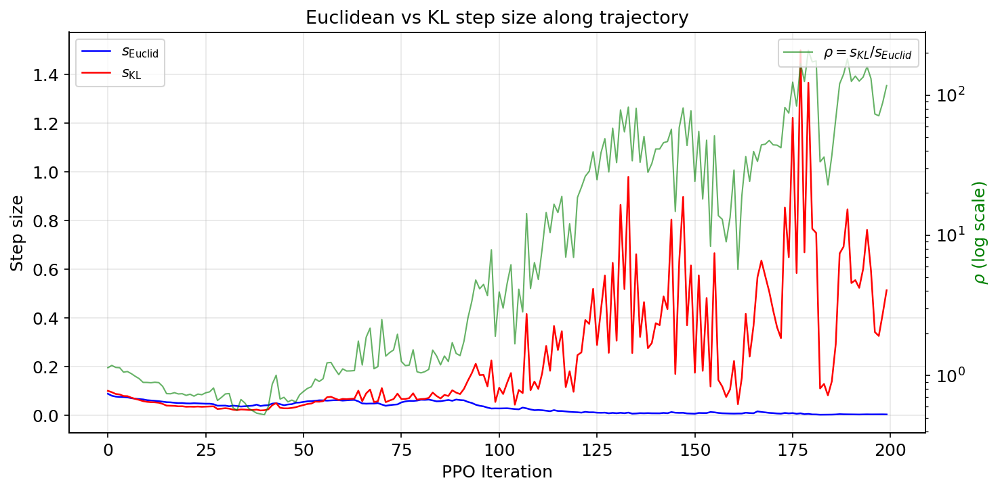

**左 y 轴**：每步的欧氏步长 $s_\text{Euclid}$ 和 KL 步长 $s_\text{KL}$；**右 y 轴** (log)：几何扭曲比 $\rho$。

$$s_\text{KL}(t \to t+1) = \sqrt{\tfrac{1}{2}\,\mathbb{E}\left[(\nabla_\theta \log \pi_{\theta_t} \cdot \Delta\theta_t)^2\right]}, \quad \rho_t = \frac{s_\text{KL}}{s_\text{Euclid}}$$

| 曲线 | 含义 |
|------|------|
| 蓝线 $s_\text{Euclid}$ | 参数空间中实际走了多远 |
| 红线 $s_\text{KL}$ | 分布空间中实际走了多远 |
| 绿线 $\rho$ | 两者之比——"每单位参数变化引起多少分布变化" |

**怎么看**：
- $s_\text{Euclid}$ 相对稳定（Adam 自适应控制参数步长）
- $s_\text{KL}$ 随训练急剧增长 → 后期微小参数变化导致巨大分布变化
- $\rho$ 变化跨 2-3 个数量级 → **直接论证了固定学习率在分布空间中的步长极不均匀**
- 这是 Natural Policy Gradient 存在意义的直观证据

---

## Fig 10: KL 效率曲线 (KL Efficiency)

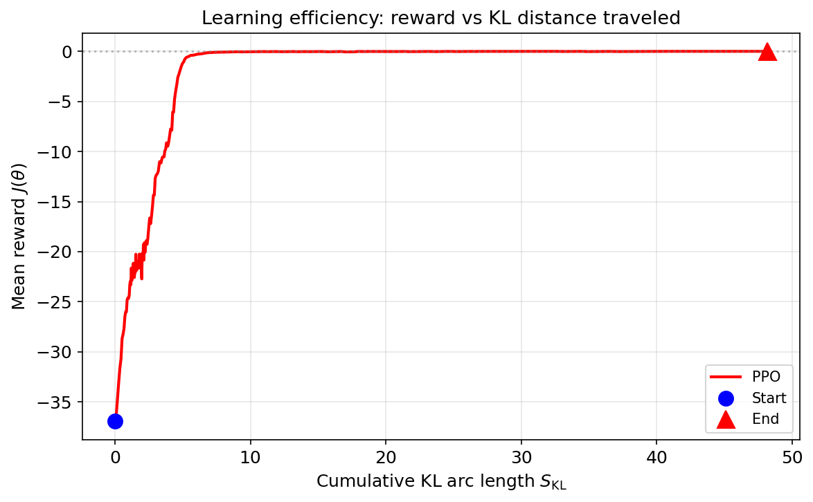

**x 轴**：累积 KL 弧长 $S_\text{KL}(t) = \sum_{k=0}^{t-1} s_\text{KL}(k \to k+1)$
**y 轴**：平均 reward $J(\theta_t)$

**怎么看**：
- 这张图将 x 轴从 "PPO iteration" 换成 "在分布空间中走了多远"
- **初期陡峭** → 每单位 KL 距离带来的 reward 提升大（高效学习阶段）
- **后期平坦** → 大量 KL 距离只带来微小提升（边际递减 / 精细调整阶段）
- 拐点位置 = 从"探索"到"收敛"的转折
- 不同架构（affine vs spline）或超参（lr, kl_coeff）的效率曲线形状可直接对比
- 理想情况下，好的算法应该在更少的 KL 距离内达到相同的 reward

---

## Fig 11: 轨迹 + FIM 椭圆 (Trajectory Ellipses)

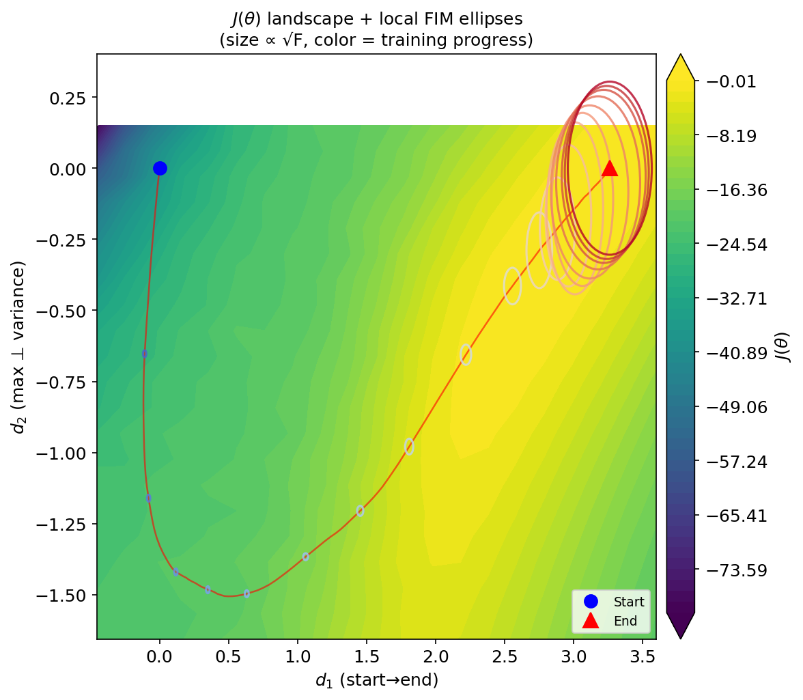

在 $J(\theta)$ 热力图上叠加 PPO 轨迹和沿轨迹的 FIM 椭圆（需 `--scan`）。

| 元素 | 含义 |
|------|------|
| 背景 | $J(\theta)$ 热力图（同 Fig 1 中面板） |
| 红线 | PPO 轨迹 |
| 蓝点/红三角 | 起点/终点 |
| 椭圆 | 局部 FIM 的可视化，每隔 10 步画一个 |

**椭圆怎么读**：
- 椭圆的**宽度** $\propto \sqrt{F_{11}}$，**高度** $\propto \sqrt{F_{22}}$
- 椭圆越大 → 该方向上参数微扰引起的分布变化越大
- 颜色从**蓝（训练初期）→ 红（训练后期）**
- 初期椭圆小（参数空间中自由移动），后期椭圆大（参数空间"变窄"）
- 椭圆的扁圆程度反映各向异性 $F_{11}/F_{22}$

---

## Fig 12: Theorem 1 验证 (Natural Gradient Bound)

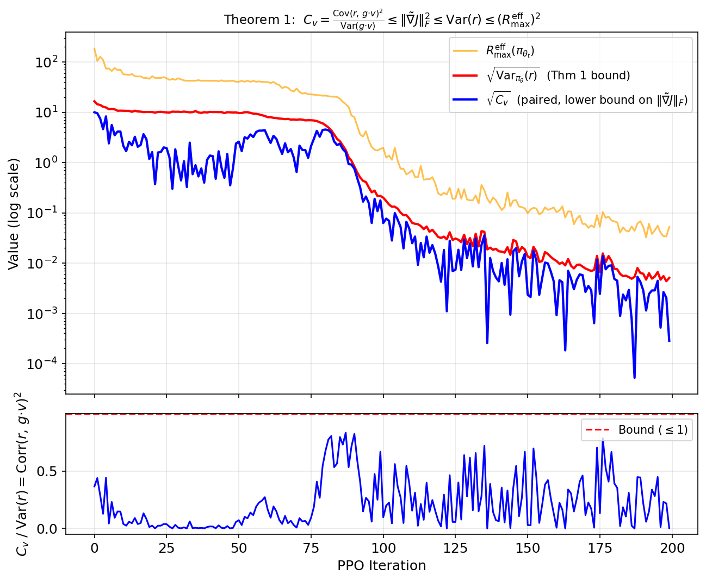

验证 report.md 中的 Theorem 1 不等式链：

$$\left|\frac{dJ}{dS_\text{KL}}\right| \leq \|\tilde{\nabla}J\|_F \leq \sqrt{\mathrm{Var}_{\pi_\theta}(r)} \leq R_\max^{\text{eff}}(\pi_\theta)$$

**上面板**（log scale）：

| 曲线 | 含义 |
|------|------|
| 蓝线 $|\Delta J / s_\text{KL}|$ | 沿轨迹的方向导数估计（Theorem 1 左端） |
| 红线 $\sqrt{\mathrm{Var}(r)}$ | Theorem 1 的 bound（reward 标准差） |
| 橙线 $R_\max^{\text{eff}}$ | 更松的 bound（batch 中最大 $|r|$） |

**下面板**：tightness ratio = $|\Delta J / s_\text{KL}| / \sqrt{\mathrm{Var}(r)}$，红色虚线为 bound ($\leq 1$)。

**怎么看**：
- **蓝线始终低于红线** → Theorem 1 成立，RL 景观确实被平滑了
- **红线始终低于橙线** → $\mathrm{Var}(r) \leq \max |r|^2$ 链条成立
- **ratio 始终 $\leq 1$** → 不等式无违反
- ratio 接近 1 的区间 = bound 最紧的阶段，分布变化在"高效利用"
- ratio 远小于 1 = PPO 没有沿最陡方向走（Adam 不是 natural gradient）
- **训练后期三条线同时下降** → 分布集中后 $\mathrm{Var}(r) \to 0$，景观自然"变平"

---

## 快速参考

| 图 | 关键问题 | 是否需要 `--scan` |
|----|---------|-------------------|
| Fig 1 | 参数空间景观 vs 原始空间 | 是 |
| Fig 2 | CMA-ES vs PPO 动态对比 | 否 |
| Fig 3 | 谁收敛更快？ | 否 |
| Fig 4 | 3D 景观直觉 | 是 |
| Fig 5 | 预训练数据覆盖情况 | 否 |
| Fig 6 | RL 前后分布对比 | 否 |
| Fig 7 | 分布如何随训练演化 | 否 |
| Fig 8 | FIM 如何随训练变化（核心） | 否 |
| Fig 9 | 参数步长 vs 分布步长（核心） | 否 |
| Fig 10 | 分布空间中的学习效率（核心） | 否 |
| Fig 11 | FIM 的空间分布 | 是 |
| Fig 12 | Theorem 1 验证（核心） | 否 |

核心新增图为 **Fig 8-10, 12**，它们只依赖沿轨迹的 FIM 计算（无需 2D 网格扫描），数值始终稳定可靠。
