# 2026.4.03
I start the trial on visualizing parameters space by drawing a 2D subspace, and figure out that we should use FIM (Fisher Information Matrix) to avoid the ambiguous parameter settings.

Here, the main ambiguous thing is the definition of roughness. Many people believes that pretraining a model actually finds a good representation of the dataset (or the problem), and the parameter space is a better space compared to the orgin space.
So one can do RL to finetune the paramaters of the pretrained network to find the solution of the optimization problem.
And why it works? People usually argues that parameter space is more smooth than origin space. And we want to visualize this.
However, if one zooms in any surface seems smooth, it will discover roughness details (skin as an example). And one can also do the oppposite to make some surface seems smooth.

Which means if in $\theta$ parameter space, a surface is roughness. One can find it smooth use $100\theta$.

$f(x)=\sin (100 x)$, use $y = 100x$ then $g(y)=\sin y = f(x)$

To avoid this kind of ambiguous. FIM will help, because

$$F(\theta)=\mathbb{E}_\theta(\nabla_\theta \log \pi_\theta(x)\nabla_\theta \log \pi_\theta(x)^T)$$

And if $\theta$ is scaled by $\alpha$, $\varphi=\alpha\theta$ then:

$${\rm d}\theta ^2 \to {\rm d}\varphi ^2 = \alpha ^2 {\rm d}\theta ^2$$

while

$${\rm d}\theta^T F(\theta) {\rm d}\theta \to {\rm d}\varphi^T F(\varphi) {\rm d}\varphi = \alpha{\rm d}\theta^T \frac{1}{\alpha^2}F(\theta) \alpha{\rm d}\theta ={\rm d}\theta^T F(\theta) {\rm d}\theta $$

We get a dimensionless (scaling free) view of the parameter space.

# 2026.4.10

The first version code (toy model) of the idea above is realized. Using PPO to rl a mlp. The aim is to generate better x s.t. Rastrigin function get minimized.

$$E(x)= A \cdot d + \sum_{i=1}^d (x^2_i-A\cos(2\pi x_i))$$

Our toy model sets $A=10, d=2$

The base model is a mlp convert a $z\sim \mathcal{N}(0,\mathbb{I}_8)$ to a $(\mu_1, \mu_2, \log \sigma_1, log \sigma_2 ) \in \mathcal{R}^4$, so the mlp predicts a Guassian distribution $\pi _\theta(x|z)$

$$\pi_\theta(x|z) = \frac{1}{2\pi\sigma_1\sigma_2}\exp\Big(-\frac{(x_1-\mu_1(z;\theta))^2}{2\sigma^2_1(z;\theta)}-\frac{(x_2-\mu_2(z;\theta))^2}{2\sigma^2_2(z;\theta)}\Big)$$

And the whole model is:

$$\pi_\theta(x)=\int p(z)\pi_\theta(x|z){\rm d}z$$

# 2026.4.13
The base model actually is a GMM. Advisor suggests that this model is ambigous when considering $\nabla_\theta \log \pi_\theta(x)$

pretrain:

$$\mathcal{L} = -\sum_{i\in D}\log \pi(x_i) = -\sum_{i\in D}\log \Big(\int p(z)\pi_\theta(x_i|z){\rm d}z\Big)$$

When doing SGD (actually Adam), we should calculate the gradient:

$$\nabla_\theta \log \Big(\int p(z)\pi_\theta(x_i|z){\rm d}z\Big) = \frac{\int p(z)\nabla_\theta\pi_\theta(x_i|z){\rm d}z}{\int p(z)\pi_\theta(x_i|z){\rm d}z}$$

The intergal is hard for the 8 dimension, we have to sample a lot of points in the 8 dimensional space and do forward propogation to get the parameters. And gadients even needs BP to do it. To slow.

To deal this, we usually choose to optimize the upper bound of L.

$$- \log \Big(\int p(z)\pi_\theta(x_i|z){\rm d}z\Big) \leq - \int p(z) \log \pi_\theta(x_i|z){\rm d}z$$

And now the gradient becomes to 

$$\int p(z)\nabla_\theta \log\pi_\theta(x_i|z){\rm d}z$$

still should use sampling to get the gradient, though $\nabla_\theta\log\pi_\theta(x_i|z)$ can be calculated, easier than $\nabla_\theta\pi_\theta(x_i|z)$

And even worse, we have to use $\nabla_\theta \log \pi_\theta(x)$ to do PPO, but the code always uses $\nabla_\theta \log \pi_\theta(x|z)$. The error of sampling always impacts the iters, which makes results ambigous.

Still, we sampled independent $(x_i,z_i)$ where $x_i\sim {\rm Uni}[-5,5]^2$ to train and rl the mlp.

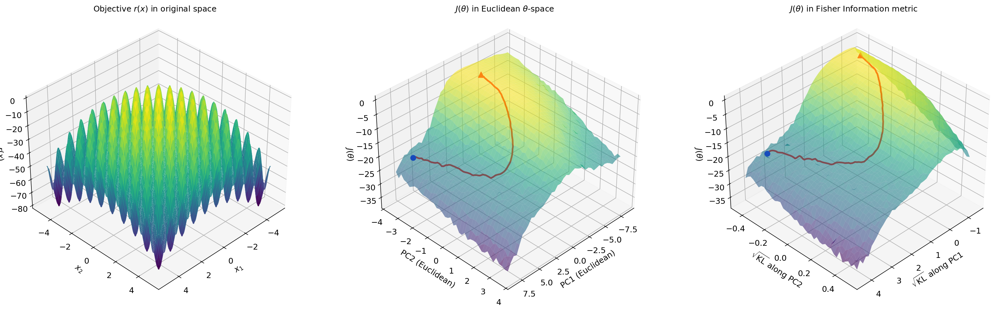

But actually one can see that the model can't be trained as a perfect uniform distribution because we only trained by a upper bound. And the ppo iters =200. RL slowly convert the distribution to a distribution concentrate on the orgin. 
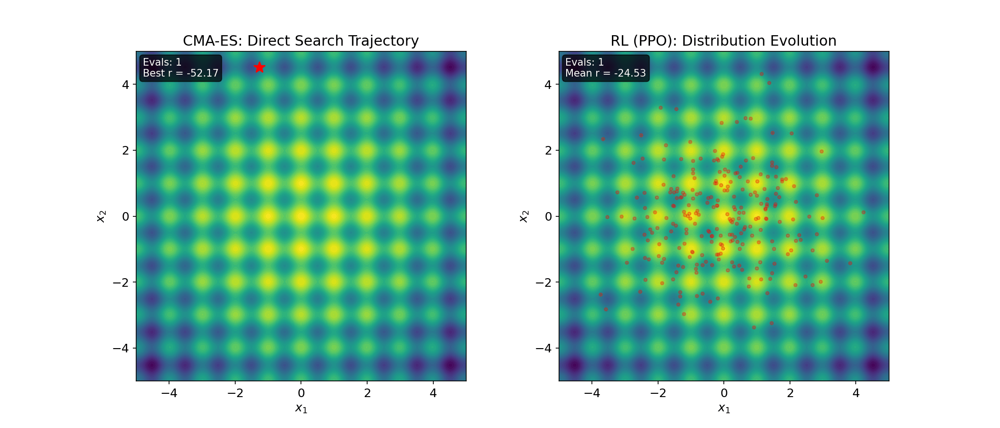

# 2026.4.20
Change the base model to Normalizing Flow Model, using RealNVP to realize it.

In a base model, it directly change a vector $z\sim N(0,\sigma^2 I)$ to a vector $x$, while the map is invertable. $x=f(z)$, then

$$p_\theta (x)= \left|\frac{\partial z}{\partial x}\right| p(z) = \left|\frac{\partial f^{-1}_\theta (x)}{\partial x}\right| p(z)$$

where $f_\theta(x)$ is a learnable network. And to make the determinant tractable, we can design the network to satisfy this. RealNVP is an example.

Divide $y$ vector in two parts, $y_{\rm var}$ and $y_{\rm fix}$

$$\begin{cases}y^{(\tau + 1)}_{\rm fix}= y^{(\tau)}_{\rm fix} \\\\ y^{(\tau + 1)}_{\rm var}=e^{s_\theta(y^{(\tau)}_{\rm fix})}\cdot y^{(\tau)}_{\rm var} + t_\theta(y^{(\tau)}_{\rm fix})\end{cases}$$

in 2D case, we choose $x_1$ or $x_2$ be fixed decided by in even or odd layer.

We use many layers combining together to get RealNVP network.

$$f_\theta(z)=f^{(N)}_{\theta_N}(...(f^{(2)}_{\theta_2}(f^{(1)}_{\theta_1}(z)))...)$$

it's actally a linear transformation.

for each layer:

$$\left|\frac{f^{(\tau)}_{\theta_\tau}(y)}{\partial y} \right|=\left|\begin{matrix} 1 & 0 \\\\ t & e^s\end{matrix} \right| = e^{s^{(\tau)}_{\theta_\tau}(y^{(\tau)}_{\rm fix})}$$

then ($y^{(1)}=z, y^{(N)}=x $)

$$\left| \frac{\partial f^{-1}_ \theta (x)}{\partial x} \right| = \exp\Big(-\sum_{\tau =1}^N s^{(\tau)}_{\theta_\tau}(y_{\rm fix}^{(\tau)})\Big)$$

then the training process needs:

$$L = -\sum_{i\in D} \log p_\theta(x_i) = \sum_{i\in D}\sum_{\tau =1}^N s^{(\tau)}_{\theta_\tau}(y_{\rm fix}^{(\tau)}(x_i))-\log p(z(x_i))$$

while the z and y are calculated by the invert transformation of each layer, these layers includes paramaters $\theta$. So actually we need use invert networks to realize the Automatic Differentiation.

In this case, I can train the model on two datasets($\beta = 0,1$):

$$p_{\rm data}(x)\propto e^{-\beta E(x)}$$

because of $E(x)\geq 0 $, so $e^{-\beta E(x)}\leq 1$. We can use Rejection Sampling to sample from $p_{\rm data}(x)$.

Generates a data from Uniform distribution of $[-5,5]^2$ and we use the accept rate $\alpha(x) = e^{-\beta E(x)}$ to accept the $x$ or not.

## $\beta = 0$

We can see how $\theta$ moves with PPO on the Reward landscape $J(\theta) = E_{\pi_\theta(x)}(r(x))$. And the third picture zooms in the FIM vision.

We can see the evolution of the samples sampled by the model in different PPO iters( Start from pretrained base model).

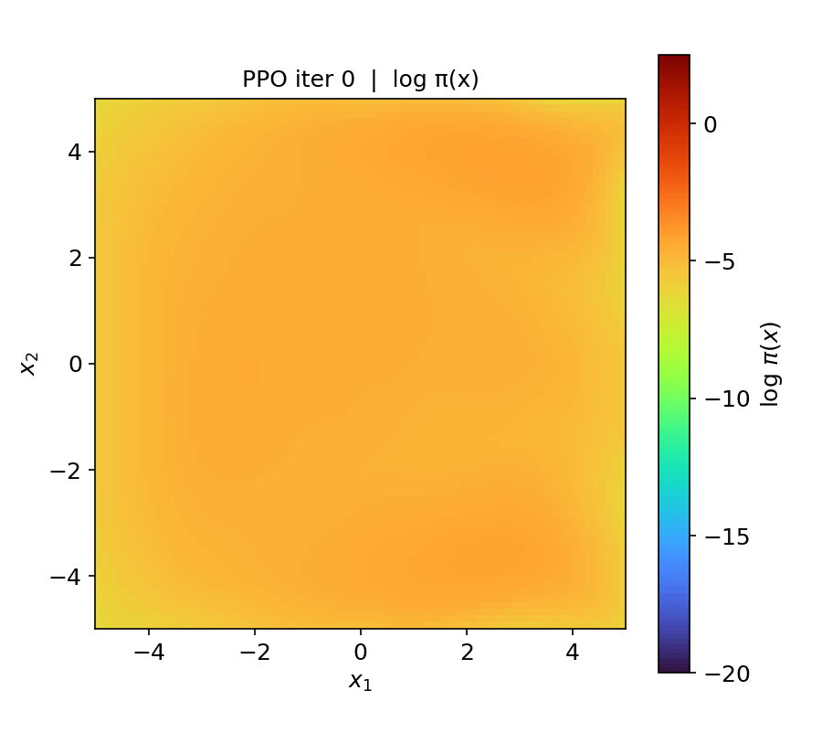

And I verified the theorem I proved.

And we also do the $\beta = 1.0$ case

## $\beta = 1.0$
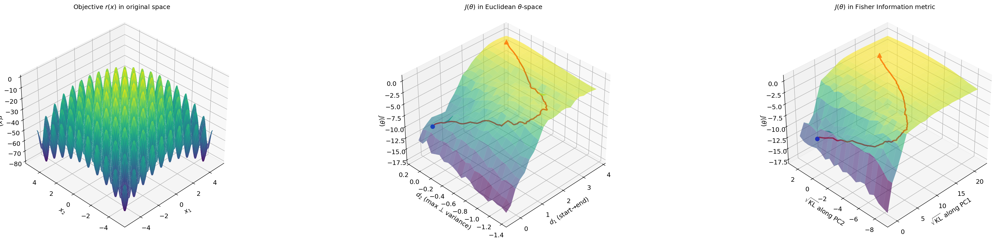

The pretrain loss is shown as follows:
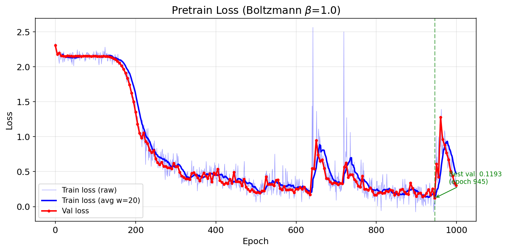

There is a weird platform at the beginning of the training. This may be contributed by a bad initiation and absence of warm up. The platform is actually a part of the entropy of Standard Gussian Distribution. (Using the dataset to calculate).

The aim distribution shown as follows:

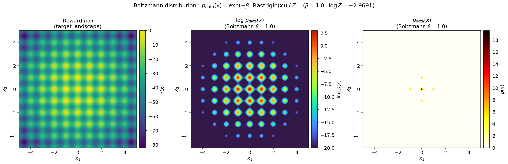

While after the model is pretrained, the distribution is:
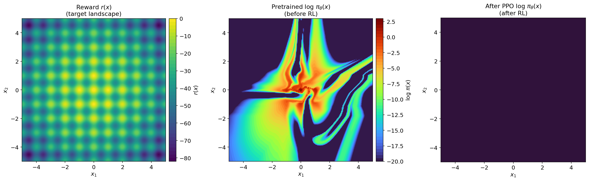

And we have to do 500 PPO iters to make the distribution collapse to the origin point (without KL divergence):

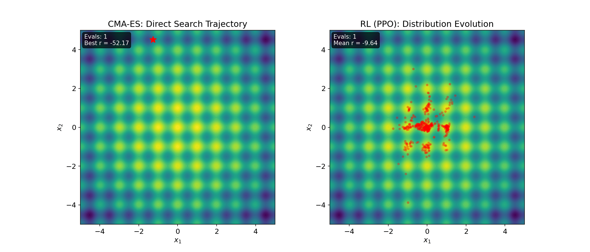

The theorem is still solid:
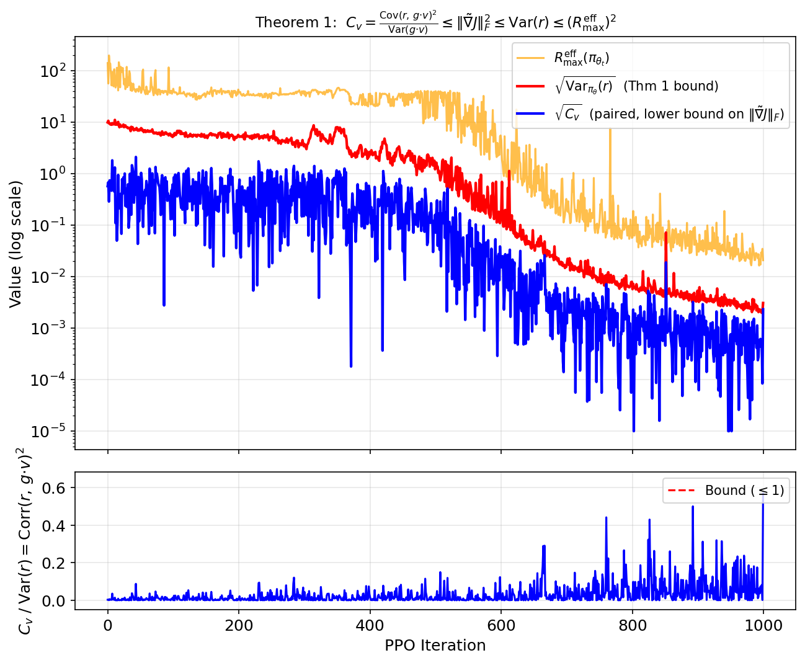

However the distribution of base model $log \pi_\theta(x)$ is so weird compared to origin $\log p_{\rm data}(x) = -E(x)$, it seems that Flow model fails to learn the dataset totally. And the RL really slow and seems not good.

# 2026.4.22
Realize unit test of my code. My RealNVP has no problem.
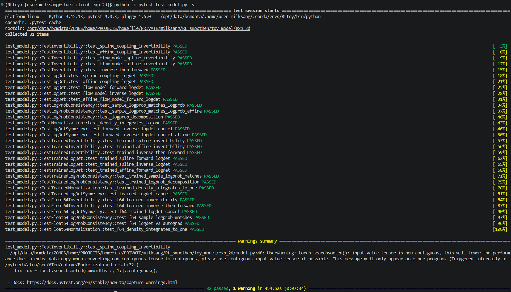

And I tried the code of https://code.itp.ac.cn/lishuohui/RealNVPplayground

The code use RealNVP to imitate the target distribution $\pi_\theta(x)\to p(x)$, and use $q(x|x')=\pi_\theta(x)$ to propose a new sample.

$$A(x\to x')=\min \\{1,\frac{p(x')\pi_\theta(x)}{p(x)\pi_\theta(x')}\\}$$ 

And if $\pi_\theta(x)=p(x)$, then the accept rate is 100%, which really accelerates the mcmc a lot.

Overall, the idea is using nerual networks to propose. For calculating of accept rate, we have to know the exact $log \pi_\theta(x)$, which means the model should give a score. Normalization Flow Model can do this.

However the effect of the toy model in Shuohui's code disappoints me. Actually, the code aims to accelerate mcmc, so a $\pi_\theta(x)$ makes $A(x\to x')>0.5$ some how is good enough. But actually in my view, Normalize Flow model should be much more accurate in this kind of easy 2D toy model.

$$E(x,y)= (\sqrt{x^2+y^2} - 2)^2/0.32 $$

The $p(x)=e^{-E(x)}$ should be a ring, and samples at last should roughly be a ring. However the Flow model fails even in this easy case.

ring2d_Nl4_Hs10_Ht10_epsilon1.0_beta1.0_delta1.0_omega1.0_Batchsize64_Ntherm10_Nsteps10_Nskips10_lr0.001 training 5000 epochs:
The acc rate from about $0.26$ rices to $0.55$. (0.26 referce to $q(x)\sim N(0,I_2)$ case). 

The pretrained RealNVP only gives that:
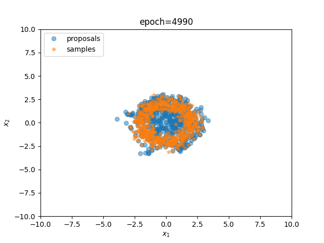

It is still nothing but a "Guassian distribution" . Maybe just a scale. It just a Unimodal function.

There must be something not good enough for this is a code progammed at 8 years ago.

# 2026.4.23
Compare my code and Shuohui's code, our difference is:

> 1. Activate Function: ReLU(mine) / ELU(his)
> 2. s,t network: One network outputs s and t(mine)/ seperates into two networks(his)
> 3. mlp sturcture: 1->64->64->2(mine)/ 2->10->10->1(his)
> 4. Initiation:  Kaiming Initiation(mine)/ $N(0, 0.01)$ (his)
> 5. clamp: s.clamp(-2,2) to avoid extreme scale of vectors(mine)/ none(his)

After the success of unit test, I believe that my network should behave better than Shuohui's network.

Maybe, I can use my settings in the Shuohui's code, then:

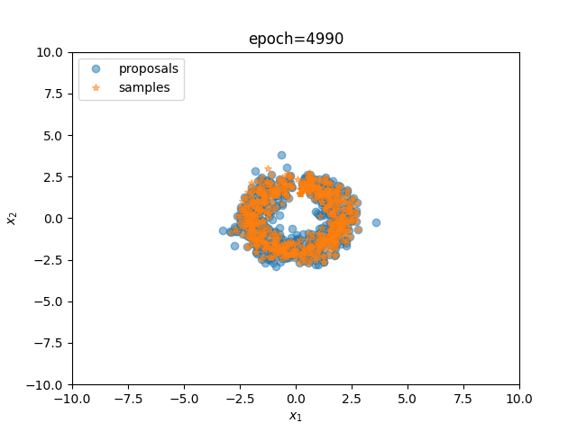

And the acc rate goes up to 0.8076, which is much higher than the origin settings.

I have changed his 1,2,4,5 settings into my settings. (which means the networks is still 2->10->10->1)

the clamp(-2,2) is important. If doesn't use this constriant, the distribution will go wild.

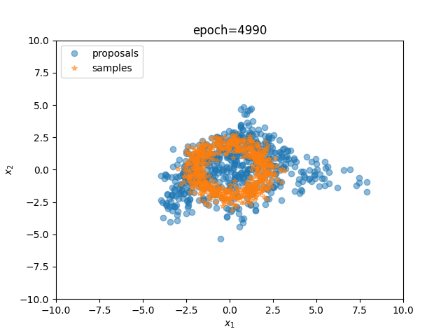

This refers that: 1. $N(0, 0.01)$ makes the traning to slow, for the gradients are too small; 2. $s.clamp(-2,2)$ helps control the RealNVP not give a extreme stretching, helps the distribution be stable.

And I split my network into two networks: (s,t) -> s,t.

# 2026.4.24

My network has its own problem. Maybe the parameters are too many, which makes the training dynamics is unstable. A can notice many crazy increases of NLL when training. This might refer to a unsuitable learning rates. (Reminds the situation that y=ax^2/2 has a learning rate bigger than 2/a).

So first I tried to split the neutwork and use learning rate that $\eta = 10^{-5}$, while the origin one is $10^{-3}$.

And my advisor prompts me that PPO rewards the Q-V>0 samples and inhibits the Q-V<0 samples. So maybe the ineffeciency PPO might be caused by the PPO batch is too small. I increase it from 256 to 1024. And turn the $\sigma$ of the initial distribution learnable:

The pretrain loss goes:(100000epochs)
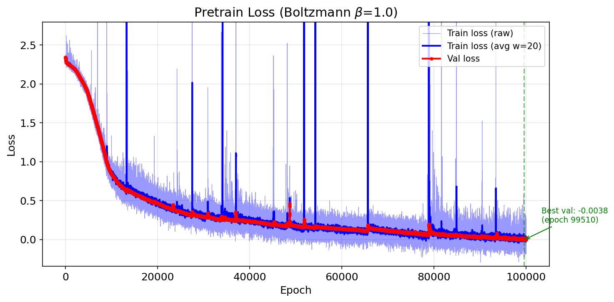

And the pretrain RealNVP gives the distribution:
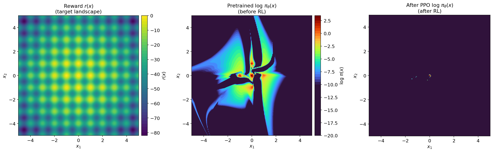

The PPO precess:
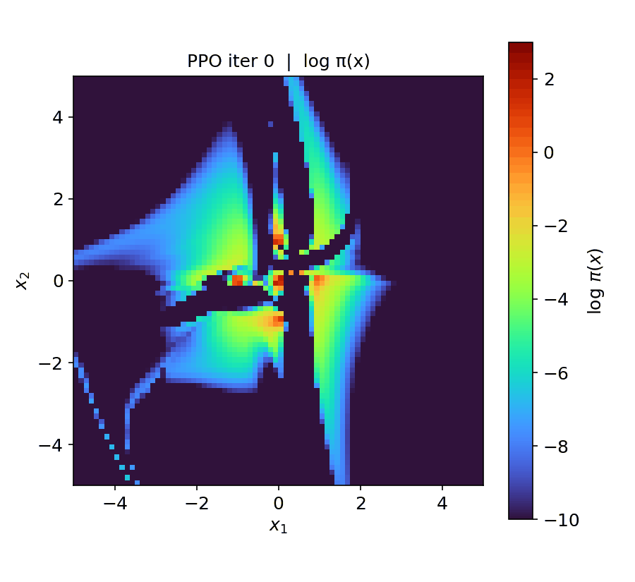

# 2026.4.27
I doubt that the strange distribution and unstable training process might blame on to many parameters. And I change the hidden dimension to 8. which makes parameters from 47k ro 2.5k.
And also add Data Augmentation to makes the training dataset satisfies  $C_{4v}$ sysmmetry. And I change the learning rate to $5\times 10^{-5}$.

And the pretraining process we have:

